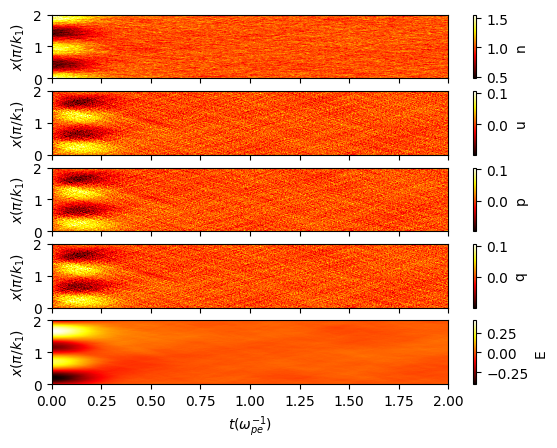
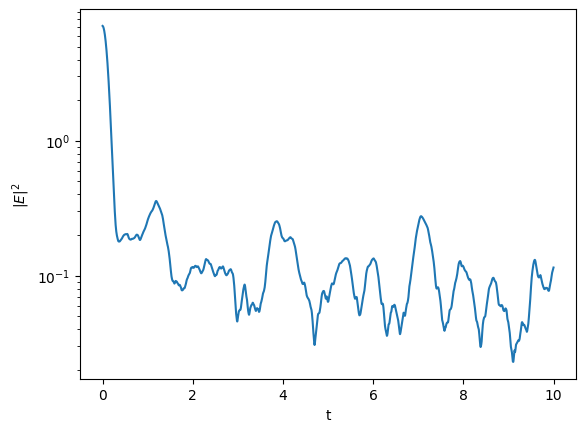

# Install dependencies

pip install numpy scipy matplotlib taichi tqdm

# Workflow
1. Use PIC solver to simulate Landau damping. Parameters are specified in the paper Qin et al. The data will be saved in the folder `data_pic`.
```bash
python pic_solver.py
```
2. Then analyze the result using the jupyter notebook `analysis_pic.ipynb`.

# Results
The results are as good as a Vlasov solver. Maybe some higher degree interpolation techniques are required.



